# Network research report

## Details

2020 Fall, Undergraduate Research Project @SKKU

## SRIOV setup
How to setup?
1. Configure the number of VMs. 
```https://blog.hkwon.me/ubuntu-18-04-netplan/
$ echo 4 > /sys/class/net/<device name>/device/sriov_numvfs
```
2. check businfo with
```
$ lshw -c network -businfo
```

3. create ip for machine, if needed by: https://www.cyberciti.biz/faq/linux-kvm-libvirt-dnsmasq-dhcp-static-ip-address-configuration-for-guest-os/

4. (virt-manager) using GUI, add Hardware in PCI with name *Virtual Functions*

5. add counterparts to the vm's routing table ( counterpart's ip: 10.0.0.4, for example)

```
route add -net 10.0.0.0 netmask 255.255.255.0 dev ens9
```

6. add vm to the counterparts' routing table ( vm's ip: 20.0.0.3 , for example)
```
route add -net 20.0.0.0 netmask 255.255.255.0 dev ens6f1
```

## Intel ixgbe driver
https://sourceforge.net/projects/e1000/files/ixgbevf%20stable/4.9.3/

## Driver On and Off
Dive into Kernel

- check current driver

- Make Kernel File
```
	make -J 10
```

- Disable current(original) driver
```
	sudo rmmod ixgbe
```

- Enable new driver
```
	sudo inmod ./ixgbe.ko
```

- Return to current driver
```
	sudo modeprobe ixgbe
```

## Check system logs
1.
```
    dmesg
```
2. 
```
    sudo vi /var/log/syslog 
```

## Extract Logs
copy n lines at the bottom
```
tail -n +[start_line] [filename] > [target_file]
```

## Unbind, and link
- locate module
```
$ modprobe vfio_pci
```

- Unbind, and link
1. check pci device
```
$ lspci -nn
03:10.1 Ethernet controller [0200]: Intel Corporation 82599 Ethernet Controller Virtual Function [8086:10ed] (rev 01)

```

2. new id (just once, maybe?)
```
sudo echo "8086 10ed" > /sys/bus/pci/drivers/ixgbevf/new_id
```

3. unbind
```
echo "0000:03:10.1" > /sys/bus/pci/devices/0000\:03\:10.1/driver/unbind
```

4. bind
```
echo "0000:03:10.1" > /sys/bus/pci/drivers/vfio-pci/bind
```

## Logs

### 2020-12-02
Q1. Vm shell : nothing
 bc, IOMMU is set by VT-d?

Q2. Why IRQ is diff?
i.e.
(ixgbevf module)
Tree'd after VM boot up [logs](./logs/treed_after_sriov_boot.txt)
Has 
```
msi_irqs
- 72 -> 'msix' 
- 73 -> 'msix'
```

Tree'd after vfio [logs](./logs/treed_after_vfio.txt)
```
msi_irqs -> '0'
```


(vfio-pci)


### 2020-12-01

Current Status

-Interface exists: enp3s16f1

```
dmk@ckjung:~$ ifconfig

(...)
enp3s16f1: flags=4163<UP,BROADCAST,RUNNING,MULTICAST>  mtu 1500
        inet 20.0.0.3  netmask 255.255.255.0  broadcast 20.0.0.255
        inet6 fe80::a44e:84ff:fe53:2164  prefixlen 64  scopeid 0x20<link>
        ether a6:4e:84:53:21:64  txqueuelen 1000  (Ethernet)
        RX packets 2  bytes 228 (228.0 B)
        RX errors 0  dropped 0  overruns 0  frame 0
        TX packets 45  bytes 5436 (5.4 KB)
        TX errors 0  dropped 0 overruns 0  carrier 0  collisions 0
  
(...)

```

```
$ sudo lspci -k
03:10.1 Ethernet controller: Intel Corporation 82599 Ethernet Controller Virtual Function (rev 01) 
        Subsystem: Intel Corporation 82599 Ethernet Controller Virtual Function                     
        Kernel driver in use: ixgbevf                                                        
        Kernel modules: ixgbevf    
```

- locate module
```
$ modprobe vfio_pci
```

- Unbind, and link
1. check pci device
```
$ lspci -nn
03:10.1 Ethernet controller [0200]: Intel Corporation 82599 Ethernet Controller Virtual Function [8086:10ed] (rev 01)

```

2. new id (just once, maybe?)
```
sudo echo "8086 10ed" > /sys/bus/pci/drivers/ixgbevf/new_id
```

3. unbind
```
echo "0000:03:10.1" > /sys/bus/pci/devices/0000\:03\:10.1/driver/unbind
```

4. bind
```
echo "0000:03:10.1" > /sys/bus/pci/drivers/vfio-pci/bind
```


- Interface Gone
```
$ ifconfig

(None)
```

```
03:10.1 Ethernet controller: Intel Corporation 82599 Ethernet Controller Virtual Function (rev 01)                                 
        Subsystem: Intel Corporation 82599 Ethernet Controller Virtual Function                                      
        Kernel driver in use: vfio-pci                                                                                             
        Kernel modules: ixgbevf     
```

- dmesg after it
```
[  235.138541] ixgbe 0000:03:00.1 ens6f1: VF Reset msg received from vf 0
[  235.158514] ixgbe 0000:03:00.1 ens6f1: VF 0 requested invalid api version 6
[  235.542523] ixgbevf 0000:03:10.1 enp3s16f1 (unregistered): ixgbevf_remove: Remove complete
[  258.094588] VFIO - User Level meta-driver version: 0.3
[  258.115382] vfio_pci: add [8086:10ed[ffff:ffff]] class 0x000000/00000000
```
Wrap Up

VFIO resource: 
- http://www.linux-kvm.org/images/5/54/01x04-Alex_Williamson-An_Introduction_to_PCI_Device_Assignment_with_VFIO.pdf
- https://www.kernel.org/doc/Documentation/vfio.txt

1. IOMMU GROUP
```
IOMMU Group 30:                                                                                                                                                                                            
        03:00.0 Ethernet controller [0200]: Intel Corporation 82599ES 10-Gigabit SFI/SFP+ Network Connection [8086:10fb] (rev 01)                                                                          
IOMMU Group 31:                                                                                                                                                                                            
        03:00.1 Ethernet controller [0200]: Intel Corporation 82599ES 10-Gigabit SFI/SFP+ Network Connection [8086:10fb] (rev 01) 
IOMMU Group 36:                                                                                                                      
        03:10.1 Ethernet controller [0200]: Intel Corporation 82599 Ethernet Controller Virtual Function [8086:10ed] (rev 01)                                
IOMMU Group 37:                                                                                                    
        03:10.3 Ethernet controller [0200]: Intel Corporation 82599 Ethernet Controller Virtual Function [8086:10ed] (rev 01)

```

2. Container Creation
```
open /dev/vfio/vfio
```

3. Group Ready
By unbinding the device from the host driver and binding it to a VFIO driver, a new VFIO group will appear for the group as /dev/vfio/$GROUP

```
dmk@ckjung:~$ ls /dev/vfio/
36  vfio
```

4. Access code
https://www.kernel.org/doc/Documentation/vfio.txt

Graphics: http://www.linux-kvm.org/images/5/54/01x04-Alex_Williamson-An_Introduction_to_PCI_Device_Assignment_with_VFIO.pdf


### 2020-11-30

Q1. What is "ixgbevf 0000:03:10.1: enabling device (0000 -> 0002)"

Can be figured in https://docs.huihoo.com/doxygen/linux/kernel/3.7/setup-res_8c_source.html#l00320
```
int pci_enable_resources(struct pci_dev *dev, int mask)
  321 {
  322     u16 cmd, old_cmd;
  323     int i;
  324     struct resource *r;
  325 
  326     pci_read_config_word(dev, PCI_COMMAND, &cmd);
  327     old_cmd = cmd;
  328 
  329     for (i = 0; i < PCI_NUM_RESOURCES; i++) {
  330         if (!(mask & (1 << i)))
  331             continue;
  332 
  333         r = &dev->resource[i];
  334 
  335         if (!(r->flags & (IORESOURCE_IO | IORESOURCE_MEM)))
  336             continue;
  337         if ((i == PCI_ROM_RESOURCE) &&
  338                 (!(r->flags & IORESOURCE_ROM_ENABLE)))
  339             continue;
  340 
  341         if (!r->parent) {
  342             dev_err(&dev->dev, "device not available "
  343                 "(can't reserve %pR)\n", r);
  344             return -EINVAL;
  345         }
  346 
  347         if (r->flags & IORESOURCE_IO)
  348             cmd |= PCI_COMMAND_IO;
  349         if (r->flags & IORESOURCE_MEM)
  350             cmd |= PCI_COMMAND_MEMORY;
  351     }
  352 
  353     if (cmd != old_cmd) {
  354         dev_info(&dev->dev, "enabling device (%04x -> %04x)\n",
  355              old_cmd, cmd);
  356         pci_write_config_word(dev, PCI_COMMAND, cmd);
  357     }
  358     return 0;
  359 }
```

```
   32 #define PCI_COMMAND     0x04    /* 16 bits */
   33 #define  PCI_COMMAND_IO     0x1 /* Enable response in I/O space */
   34 #define  PCI_COMMAND_MEMORY 0x2 /* Enable response in Memory space */
```

Q2. MAC: %d message comes from: https://github.com/torvalds/linux/blob/master/drivers/net/ethernet/intel/ixgbevf/ixgbevf_main.c
ixgbevf_main, ixgbe_probe
```
/* print the VF info */
	dev_info(&pdev->dev, "%pM\n", netdev->dev_addr);
	dev_info(&pdev->dev, "MAC: %d\n", hw->mac.type);

```

Breakthrough: vfio-pci

before vm boot
```
$ sudo lspci -k
03:10.1 Ethernet controller: Intel Corporation 82599 Ethernet Controller Virtual Function (rev 01)
        Subsystem: Intel Corporation 82599 Ethernet Controller Virtual Function
        Kernel driver in use: ixgbevf
        Kernel modules: ixgbevf
03:10.3 Ethernet controller: Intel Corporation 82599 Ethernet Controller Virtual Function (rev 01)
        Subsystem: Intel Corporation 82599 Ethernet Controller Virtual Function
        Kernel driver in use: ixgbevf
        Kernel modules: ixgbevf

```

after vm boot
```
$ sudo lspci -k
03:10.1 Ethernet controller: Intel Corporation 82599 Ethernet Controller Virtual Function (rev 01)
        Subsystem: Intel Corporation 82599 Ethernet Controller Virtual Function
        Kernel driver in use: vfio-pci
        Kernel modules: ixgbevf
03:10.3 Ethernet controller: Intel Corporation 82599 Ethernet Controller Virtual Function (rev 01)
        Subsystem: Intel Corporation 82599 Ethernet Controller Virtual Function
        Kernel driver in use: ixgbevf
        Kernel modules: ixgbevf
```

pci device setup: https://www.nepirity.com/blog/kvm-gpu-passthrough/

```
$ lspci -nn
03:00.0 Ethernet controller [0200]: Intel Corporation 82599ES 10-Gigabit SFI/SFP+ Network Connection [8086:10fb] (rev 01)                                            
03:00.1 Ethernet controller [0200]: Intel Corporation 82599ES 10-Gigabit SFI/SFP+ Network Connection [8086:10fb] (rev 01)                                                     
03:10.1 Ethernet controller [0200]: Intel Corporation 82599 Ethernet Controller Virtual Function [8086:10ed] (rev 01)                                                           
03:10.3 Ethernet controller [0200]: Intel Corporation 82599 Ethernet Controller Virtual Function [8086:10ed] (rev 01)
```

/etc/modprobe.d/vfio.conf 
```
options vfio-pci ids=8086:10ed          
```

/etc/modules-load.d/vfio-pci.conf
```
vfio-pci
```

Assigning devices with vt-d: http://www.linux-kvm.org/page/How_to_assign_devices_with_VT-d_in_KVM


-> Other task: interface is down, after this!

TMR: check how to create interface with vfio


### 2020-11-26
On PCI Driver : https://www.oreilly.com/library/view/linux-device-drivers/0596005903/ch12.html

Tree'd before VM boot up [logs](./logs/treed_before_sriov_boot.txt)
```
tree /sys/bus/pci/devices/0000\:03\:10.1
```


Tree'd after VM boot up [logs](./logs/treed_after_sriov_boot.txt)
```
tree /sys/bus/pci/devices/0000\:03\:10.1
```


In vm
```
vm0@vm0-Standard-PC-i440FX-PIIX-1996:~$ lspci
00:00.0 Host bridge: Intel Corporation 440FX - 82441FX PMC [Natoma] (rev 02)
00:01.0 ISA bridge: Intel Corporation 82371SB PIIX3 ISA [Natoma/Triton II]
00:01.1 IDE interface: Intel Corporation 82371SB PIIX3 IDE [Natoma/Triton II]
00:01.3 Bridge: Intel Corporation 82371AB/EB/MB PIIX4 ACPI (rev 03)
00:02.0 VGA compatible controller: Red Hat, Inc. QXL paravirtual graphic card (rev 04)
00:03.0 Ethernet controller: Realtek Semiconductor Co., Ltd. RTL-8100/8101L/8139 PCI Fast Ethernet Adapter (rev 20)
00:04.0 Audio device: Intel Corporation 82801FB/FBM/FR/FW/FRW (ICH6 Family) High Definition Audio Controller (rev 01)
00:05.0 USB controller: Intel Corporation 82801I (ICH9 Family) USB UHCI Controller #1 (rev 03)
00:05.1 USB controller: Intel Corporation 82801I (ICH9 Family) USB UHCI Controller #2 (rev 03)
00:05.2 USB controller: Intel Corporation 82801I (ICH9 Family) USB UHCI Controller #3 (rev 03)
00:05.7 USB controller: Intel Corporation 82801I (ICH9 Family) USB2 EHCI Controller #1 (rev 03)
00:06.0 Communication controller: Red Hat, Inc. Virtio console
00:07.0 SCSI storage controller: Red Hat, Inc. Virtio block device
00:08.0 Unclassified device [00ff]: Red Hat, Inc. Virtio memory balloon
00:09.0 Ethernet controller: Intel Corporation 82599 Ethernet Controller Virtual Function (rev 01)
```

```
vm0@vm0-Standard-PC-i440FX-PIIX-1996:/sys/bus/pci/devices$ cd 0000\:00\:09.0
vm0@vm0-Standard-PC-i440FX-PIIX-1996:/sys/bus/pci/devices/0000:00:09.0$ l
ari_enabled               device           local_cpulist   numa_node  revision
broken_parity_status      dma_mask_bits    local_cpus      power/     subsystem@
class                     driver@          max_link_speed  remove     subsystem_device
config                    driver_override  max_link_width  rescan     subsystem_vendor
consistent_dma_mask_bits  enable           modalias        reset      uevent
current_link_speed        firmware_node@   msi_bus         resource   vendor
current_link_width        irq              msi_irqs/       resource0
d3cold_allowed            link/            net/            resource3
vm0@vm0-Standard-PC-i440FX-PIIX-1996:/sys/bus/pci/devices/0000:00:09.0$ cd driver/
0000:00:09.0/ module/       
vm0@vm0-Standard-PC-i440FX-PIIX-1996:/sys/bus/pci/devices/0000:00:09.0$ cd driver/
0000:00:09.0/ module/       
vm0@vm0-Standard-PC-i440FX-PIIX-1996:/sys/bus/pci/devices/0000:00:09.0$ l
ari_enabled               device           local_cpulist   numa_node  revision
broken_parity_status      dma_mask_bits    local_cpus      power/     subsystem@
class                     driver@          max_link_speed  remove     subsystem_device
config                    driver_override  max_link_width  rescan     subsystem_vendor
consistent_dma_mask_bits  enable           modalias        reset      uevent
current_link_speed        firmware_node@   msi_bus         resource   vendor
current_link_width        irq              msi_irqs/       resource0
d3cold_allowed            link/            net/            resource3
```

### 2020-11-24
logs
1. after sriov add
```
[  956.335267] [1-1] hello ixgbevf!                                                                                                                                                                        
[  956.335270] ixgbevf: Intel(R) 10GbE PCI Express Virtual Function Driver - version 4.9.3
[  956.335271] [1-2] hello ixgbevf!
[  956.335272] ixgbevf: Copyright(c) 1999 - 2020 Intel Corporation.
[  956.335273] [1-3] hello ixgbevf!
[  956.335341] [1-4] hello ixgbevf!
```

2. after sriov setting by echo 2 > [path]

```
[ 1105.137609] ixgbe 0000:03:00.1: SR-IOV enabled with 2 VFs
[ 1105.137613] ixgbe 0000:03:00.1: configure port vlans to keep your VFs secure
[ 1105.137753] ixgbe 0000:03:00.1: removed PHC on ens6f1
[ 1105.204340] ixgbe 0000:03:00.1: Multiqueue Enabled: Rx Queue count = 4, Tx Queue count = 4 XDP Queue count = 0
[ 1105.222534] ixgbe 0000:03:00.1: registered PHC device on ens6f1
[ 1105.392372] ixgbe 0000:03:00.1 ens6f1: detected SFP+: 4
[ 1105.435949] pci 0000:03:10.1: [8086:10ed] type 00 class 0x020000
[ 1105.436200] iommu: Adding device 0000:03:10.1 to group 36
[ 1105.436391] [2-1] ixgbevf_probe started
[ 1105.436393] [2-2] ixgbevf_probe, enable device and dma setting
[ 1105.436402] ixgbevf 0000:03:10.1: enabling device (0000 -> 0002)
[ 1105.436417] [2-3] ixgbevf_probe, allocate etherdev
[ 1105.507968] ixgbe 0000:03:00.1 ens6f1: VF Reset msg received from vf 0
[ 1105.531949] ixgbe 0000:03:00.1 ens6f1: VF 0 requested invalid api version 6
[ 1105.532937] ixgbevf 0000:03:10.1: MAC address not assigned by administrator.
[ 1105.532940] ixgbevf 0000:03:10.1: Assigning random MAC address
[ 1105.532943] [2-4] init work here
[ 1105.532944] [2-5] init interrupt scheme here
[ 1105.533569] ixgbevf 0000:03:10.1: Multiqueue Enabled: Rx Queue count = 2, Tx Queue count = 2 XDP Queue count 0
[ 1105.533992] [2-6] netdev name: eth0
[ 1105.534001] ixgbevf 0000:03:10.1: 62:70:94:d5:66:54
[ 1105.534004] ixgbevf 0000:03:10.1 eth0: ixgbevf_probe: Intel(R) 82599 Virtual Function
[ 1105.534006] ixgbevf 0000:03:10.1 eth0: ixgbevf_probe: GRO is enabled
[ 1105.534008] ixgbevf 0000:03:10.1 eth0: ixgbevf_probe: Intel(R) 10GbE PCI Express Virtual Function Driver
[ 1105.534069] pci 0000:03:10.3: [8086:10ed] type 00 class 0x020000
[ 1105.534265] iommu: Adding device 0000:03:10.3 to group 37
[ 1105.534386] [2-1] ixgbevf_probe started
[ 1105.534388] [2-2] ixgbevf_probe, enable device and dma setting
[ 1105.534397] ixgbevf 0000:03:10.3: enabling device (0000 -> 0002)
[ 1105.534410] [2-3] ixgbevf_probe, allocate etherdev
[ 1105.538272] ixgbevf 0000:03:10.1 enp3s16f1: renamed from eth0
[ 1105.594334] ixgbe 0000:03:00.1 ens6f1: NIC Link is Up 10 Gbps, Flow Control: RX/TX
[ 1105.594698] DMAR: 64bit 0000:03:10.1 uses identity mapping
[ 1105.608025] ixgbe 0000:03:00.1 ens6f1: VF Reset msg received from vf 1
[ 1105.626843] ixgbevf 0000:03:10.1 enp3s16f1: NIC Link is Up 10 Gbps
[ 1105.628395] IPv6: ADDRCONF(NETDEV_UP): enp3s16f1: link is not ready
[ 1105.628492] IPv6: ADDRCONF(NETDEV_CHANGE): enp3s16f1: link becomes ready
[ 1105.631905] ixgbe 0000:03:00.1 ens6f1: VF 1 requested invalid api version 6
[ 1105.632891] ixgbevf 0000:03:10.3: MAC address not assigned by administrator.
[ 1105.632893] ixgbevf 0000:03:10.3: Assigning random MAC address
[ 1105.632894] [2-4] init work here
[ 1105.632894] [2-5] init interrupt scheme here
[ 1105.633473] ixgbevf 0000:03:10.3: Multiqueue Enabled: Rx Queue count = 2, Tx Queue count = 2 XDP Queue count 0
[ 1105.634981] [2-6] netdev name: eth0
[ 1105.634988] ixgbevf 0000:03:10.3: 26:6a:60:00:ed:3f
[ 1105.634990] ixgbevf 0000:03:10.3 eth0: ixgbevf_probe: Intel(R) 82599 Virtual Function
[ 1105.634991] ixgbevf 0000:03:10.3 eth0: ixgbevf_probe: GRO is enabled
[ 1105.634993] ixgbevf 0000:03:10.3 eth0: ixgbevf_probe: Intel(R) 10GbE PCI Express Virtual Function Driver
[ 1105.641893] ixgbevf 0000:03:10.3 enp3s16f3: renamed from eth0

```

3. adding HW

nothing

4. VM Power On
```
[ 1820.697873] audit: type=1400 audit(1606200502.923:56): apparmor="STATUS" operation="profile_load" profile="unconfined" name="libvirt-8d6ed7b3-97b0-4f3d-a1ca-1849c9ec05f1" pid=15693 comm="apparmor_parser"
[ 1820.717488] VFIO - User Level meta-driver version: 0.3
[ 1820.825811] ixgbe 0000:03:00.1 ens6f1: VF Reset msg received from vf 0
[ 1820.845824] ixgbe 0000:03:00.1 ens6f1: VF 0 requested invalid api version 6
[ 1820.949867] ixgbevf 0000:03:10.1 enp3s16f1 (unregistered): ixgbevf_remove: Remove complete
[ 1821.098223] audit: type=1400 audit(1606200503.323:57): apparmor="STATUS" operation="profile_replace" profile="unconfined" name="libvirt-8d6ed7b3-97b0-4f3d-a1ca-1849c9ec05f1" pid=15723 comm="apparmor_parser"
[ 1821.236798] audit: type=1400 audit(1606200503.459:58): apparmor="STATUS" operation="profile_replace" profile="unconfined" name="libvirt-8d6ed7b3-97b0-4f3d-a1ca-1849c9ec05f1" pid=15726 comm="apparmor_parser"
[ 1821.391379] audit: type=1400 audit(1606200503.615:59): apparmor="STATUS" operation="profile_replace" info="same as current profile, skipping" profile="unconfined" name="libvirt-8d6ed7b3-97b0-4f3d-a1ca-1849c9ec05f1" pid=15729 comm="apparmor_parser"
[ 1821.587573] audit: type=1400 audit(1606200503.811:60): apparmor="STATUS" operation="profile_replace" profile="unconfined" name="libvirt-8d6ed7b3-97b0-4f3d-a1ca-1849c9ec05f1" pid=15755 comm="apparmor_parser"
[ 1821.665303] L1TF CPU bug present and SMT on, data leak possible. See CVE-2018-3646 and https://www.kernel.org/doc/html/latest/admin-guide/l1tf.html for details.
[ 1821.962662] vfio-pci 0000:03:10.1: enabling device (0000 -> 0002)
[ 1822.234451] IPv6: ADDRCONF(NETDEV_UP): macvtap0: link is not ready
[ 1825.978150] ixgbe 0000:03:00.1 ens6f1: Unhandled Msg 00000000
[ 1828.191398] ixgbe 0000:03:00.1 ens6f1: VF Reset msg received from vf 0
[ 1828.201791] ixgbe 0000:03:00.1 ens6f1: VF 0 requested invalid api version 5
[ 1831.288395] snd_hda_intel 0000:00:1b.0: IRQ timing workaround is activated for card #0. Suggest a bigger bdl_pos_adj.

```
5. dmesg at VM
```
[    1.076366] ixgbevf: Intel(R) 10 Gigabit PCI Express Virtual Function Network Driver - version 4.1.0-k
[    1.076366] ixgbevf: Copyright (c) 2009 - 2018 Intel Corporation.
[    1.091285] ixgbevf 0000:00:09.0: PF still in reset state.  Is the PF interface up?
[    1.091286] ixgbevf 0000:00:09.0: Assigning random MAC address
[    1.127167] virtio_net virtio0 ens3: renamed from eth0
[    1.127956] usb 1-1: new high-speed USB device number 2 using ehci-pci
[    1.130631] ixgbevf 0000:00:09.0: 02:12:b7:f6:df:25
[    1.130632] ixgbevf 0000:00:09.0: MAC: 1
[    1.130633] ixgbevf 0000:00:09.0: Intel(R) 82599 Virtual Function
[    1.131585] ixgbevf 0000:00:09.0 ens9: renamed from eth0

```


### 2020-11-23
Doubt: in vm log, but not in host vf setup
```
	ixgbevf_main.c:3855:    e_info(drv, "NIC Link is Up %s\n", speed_str);
```

ixgbevf_watchdog_link_is up @ ixgbevf_main.c
ixgbevf_watchdog_subtask @ same
ixgbevf_service_task @ same
ixgbevf_probe @ same

### 2020-11-19
dmseg logs
[dmesg logs](./logs/after_add_hw_take1.txt)
```
[262330.138798] audit: type=1400 audit(1605772849.885:87): apparmor="STATUS" operation="profile_load" profile="unconfined" name="libvirt-8d6ed7b3-97b0-4f3d-a1ca-1849c9ec05f1" pid=31042 comm="apparmor_parser"

ixgbe_sriov.c, ixgbe_vf_reset_msg()
[262330.232808] ixgbe 0000:03:00.1 ens6f1: VF Reset msg received from vf 0

ixgbe_sriov.c, ixgbe_negotiate_vf_api()
[262330.252758] ixgbe 0000:03:00.1 ens6f1: VF 0 requested invalid api version 6

ixgbevf_main, ixgbevf_remove()
[262330.312818] ixgbevf 0000:03:10.1 enp3s16f1 (unregistered): ixgbevf_remove: Remove complete

[262330.461538] audit: type=1400 audit(1605772850.209:88): apparmor="STATUS" operation="profile_replace" profile="unconfined" name="libvirt-8d6ed7b3-97b0-4f3d-a1ca-1849c9ec05f1" pid=31058 comm="apparmor_parser"
[262330.603307] audit: type=1400 audit(1605772850.349:89): apparmor="STATUS" operation="profile_replace" profile="unconfined" name="libvirt-8d6ed7b3-97b0-4f3d-a1ca-1849c9ec05f1" pid=31061 comm="apparmor_parser"
[262330.744422] audit: type=1400 audit(1605772850.489:90): apparmor="STATUS" operation="profile_replace" info="same as current profile, skipping" profile="unconfined" name="libvirt-8d6ed7b3-97b0-4f3d-a1ca-1849c9ec05f1" pid=31064 comm="apparmor_parser"
[262330.888236] audit: type=1400 audit(1605772850.633:91): apparmor="STATUS" operation="profile_replace" profile="unconfined" name="libvirt-8d6ed7b3-97b0-4f3d-a1ca-1849c9ec05f1" pid=31083 comm="apparmor_parser"
[262331.209509] vfio-pci 0000:03:10.1: enabling device (0000 -> 0002)

ixgbe_sriov.c, ixgbe_rcv_msg_from_vf()
[262335.305327] ixgbe 0000:03:00.1 ens6f1: Unhandled Msg 00000000

ixgbe_sriov.c, ixgbe_vf_reset_msg()
[262337.037911] ixgbe 0000:03:00.1 ens6f1: VF Reset msg received from vf 0


ixgbe_sriov.c, ixgbe_negotiate_vf_api()
[262337.048358] ixgbe 0000:03:00.1 ens6f1: VF 0 requested invalid api version 5

[262417.812451] audit: type=1400 audit(1605772937.560:92): apparmor="STATUS" operation="profile_remove" profile="unconfined" name="libvirt-8d6ed7b3-97b0-4f3d-a1ca-1849c9ec05f1" pid=31936 comm="apparmor_parser"

ixgbevf_main.c. ixgbevf_probe()
[262417.814642] [2-1] ixgbevf_probe started
[262417.814642] [2-2] ixgbevf_probe, enable device and dma setting
[262417.814647] ixgbevf 0000:03:10.1: enabling device (0000 -> 0002)
[262417.814657] [2-3] ixgbevf_probe, allocate etherdev

ixgbe_sriov.c, ixgbe_rcv_msg_from_vf()
[262417.885594] ixgbe 0000:03:00.1 ens6f1: Unhandled Msg 00000000

ixgbevf_main.c, ixgbevf_sw_init()
[262417.905280] ixgbevf 0000:03:10.1: PF still in reset state.  Is the PF interface up?
[262417.905283] ixgbevf 0000:03:10.1: Assigning random MAC address

ixgbevf_main.c, ixgbevf_init_interrupt_scheme
[262417.905397] ixgbevf 0000:03:10.1: Multiqueue Disabled: Rx Queue count = 1, Tx Queue count = 1 XDP Queue count 0
[262417.905842] ixgbevf 0000:03:10.1: 6a:3c:3b:1a:c7:7c

ixgbevf_main.c. ixgbevf_probe()
[262417.905845] ixgbevf 0000:03:10.1 eth0: ixgbevf_probe: Intel(R) 82599 Virtual Function
[262417.905848] ixgbevf 0000:03:10.1 eth0: ixgbevf_probe: GRO is enabled
[262417.905851] ixgbevf 0000:03:10.1 eth0: ixgbevf_probe: Intel(R) 10GbE PCI Express Virtual Function Driver


[262417.910257] ixgbevf 0000:03:10.1 enp3s16f1: renamed from eth0
[262418.033302] ixgbe 0000:03:00.1 ens6f1: VF Reset msg received from vf 0
[262418.053274] ixgbe 0000:03:00.1 ens6f1: VF 0 requested invalid api version 6

[262418.054380] DMAR: 64bit 0000:03:10.1 uses identity mapping
[262418.072378] IPv6: ADDRCONF(NETDEV_UP): enp3s16f1: link is not ready
[262418.080484] IPv6: ADDRCONF(NETDEV_UP): enp3s16f1: link is not ready
```

### 2020-11-16
system logs

### 2020-11-13
Thoughts on Further Tasks

1. If SR_IOV is set, and numvfs == 2, 2 interfaces noticable.
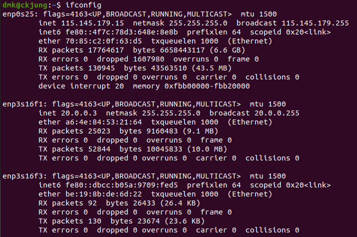

2. Ip setting possible, by netplan

3. **However**, packet is sent to ixgbe interface, not ixgbevf interface


So, 
1. Follow up the process of the vf interface is set to vm interface

2. can be done by: 
- fix ixgbe driver at host,
- perform add hw, or something to set vf interface and vfdriver up
- and follow the kernel ixgbe logs 

Good Luck!

### 2020-11-12
Objectives:
1. How PF distinguish VM0, VM1, ... so on
2. How VF sends message to PF, saying "it's me"
3. what kind of roles the KVM takes?

Answers:
1. 

Code 1: at ixgbe_sriov.c, function __ixgbe_enable_sriov
```
/* Allocate memory for per VF control structures */
adapter->vfinfo = kcalloc(num_vfs, sizeof(struct vf_data_storage),
				  GFP_KERNEL);
```

Code 2: struct ixgbe_adapter at ixgbe.h

```
struct ixgbe_adapter {
...
	unsigned int num_vfs;
	unsigned int max_vfs;
	struct vf_data_storage *vfinfo;
	int vf_rate_link_speed;
	struct vf_macvlans vf_mvs;
	struct vf_macvlans *mv_list;
...
}
```

Code 3: struct vf_data_storage, struct vf_macvlans at ixgbe.h 

```
struct vf_data_storage {
	struct pci_dev *vfdev;
	unsigned char vf_mac_addresses[ETH_ALEN];
	u16 vf_mc_hashes[IXGBE_MAX_VF_MC_ENTRIES];
	u16 num_vf_mc_hashes;
	bool clear_to_send;
	struct vf_stats vfstats;
	struct vf_stats last_vfstats;
	struct vf_stats saved_rst_vfstats;
	bool pf_set_mac;
	u16 pf_vlan; /* When set, guest VLAN config not allowed. */
	u16 pf_qos;
	u16 tx_rate;
	u8 spoofchk_enabled;
#ifdef HAVE_NDO_SET_VF_RSS_QUERY_EN
	bool rss_query_enabled;
#endif
	u8 trusted;
	int xcast_mode;
	unsigned int vf_api;
};

struct vf_macvlans {
	struct list_head l;
	int vf;
	bool free;
	bool is_macvlan;
	u8 vf_macvlan[ETH_ALEN];
};
```

adapter->vfinfo
Memory allocation


### 2020-11-11
Objective
1. Test some functions on [Companion Guide](./82599-sr-iov-driver-companion-guide.pdf)
- ethtools: VF driver is a standard driver
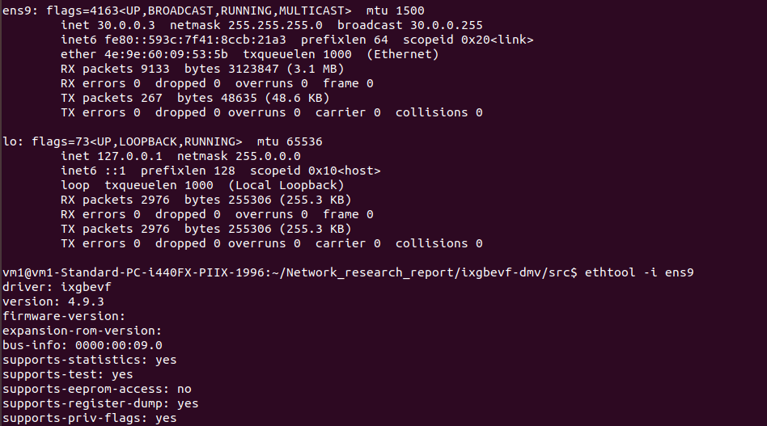

### 2020-11-10
To enable drivers,
- go to ixgbe-<x.x.x>/src/
- and sudo make
	- binutils(https://zoomadmin.com/HowToInstall/UbuntuPackage/binutils-common) : sudo apt install -y binutils-common
	- install gcc
- and ixgbe.ko will be on at
/lib/modules/5.4.0-52-generic/updates/drivers/net/ethernet/intel/ixgbevf/ixgbevf.ko

- *Do* 
```
	make
```

```
	sudo rmmod ixgbe
```

```
	sudo inmod ./ixgbe.ko
```

### 2020-11-09
Dive into Kernel

- check current driver

- Make Kernel File
```
	make -J 10
```

- Disable current(original) driver
```
	sudo rmmod ixgbe
```

- Enable new driver
```
	sudo inmod ./ixgbe.ko
```

- Return to current driver
```
	sudo modeprobe ixgbe
```

- View Logs
```
	dmesg
```

netplan setup
https://blog.hkwon.me/ubuntu-18-04-netplan/

### 2020-11-04
downloaded ixgbe_vf from : https://sourceforge.net/projects/e1000/

How to setup?
1. Configure the number of VMs. 
```
$ echo 4 > /sys/class/net/<device name>/device/sriov_numvfs
```
2. check businfo with
```
$ lshw -c network -businfo
```

3. create ip for machine, if needed by: https://www.cyberciti.biz/faq/linux-kvm-libvirt-dnsmasq-dhcp-static-ip-address-configuration-for-guest-os/

4. (virt-manager) using GUI, add Hardware in PCI with name *Virtual Functions*

5. add counterparts to the vm's routing table ( counterpart's ip: 10.0.0.4, for example)
```
route add -net 10.0.0.0 netmask 255.255.255.0 dev ens9
```

6. add vm to the counterparts' routing table ( vm's ip: 20.0.0.3 , for example)
```
route add -net 20.0.0.0 netmask 255.255.255.0 dev ens6f1
```


### 2020-11-02
problems
1. Network default is not active
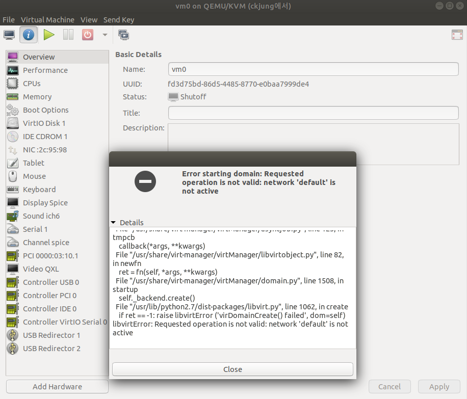
2. Tried to restart, but "protocol wrong type for socket" error
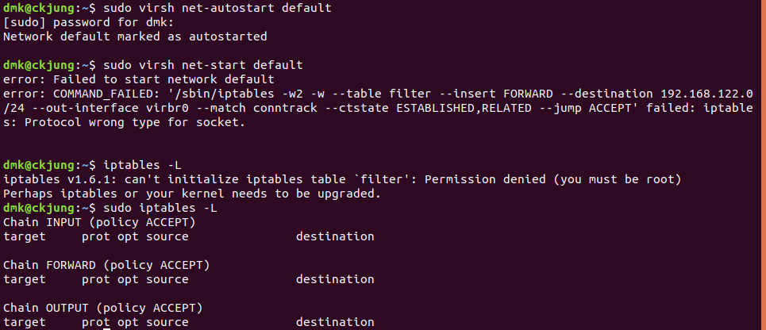

### 2020-10-30
How to setup?
1. Configure the number of VMs. 
```
$ echo 4 > /sys/class/net/<device name>/device/sriov_numvfs
```
2. check businfo with
```
$ lshw -c network -businfo
```

3. create ip for machine, if needed by: https://www.cyberciti.biz/faq/linux-kvm-libvirt-dnsmasq-dhcp-static-ip-address-configuration-for-guest-os/
	- issue1 :  
	```
	$ sudo virsh net-start default
	```
	```
         	error: Failed to start network default
         	error: internal error: Failed to apply firewall rules /sbin/iptables -w --table filter --insert FORWARD --destination 192.168.122.0/24 --out-interface virbr0 --match conntrack --ctstate ESTABLISHED,RELATED --jump ACCEPT: iptables: Protocol wrong type for socket.
	```
	
	-issue 2: virsh default xml missing
	https://blog.programster.org/kvm-missing-default-network
	

3. (virt-manager) using GUI, add Hardware in PCI with name *Virtual Functions*


### 2020-10-29
About VMDq(virtual machine device queue): https://www.youtube.com/watch?v=QvKXbpV6WXk
=> into multiple queues

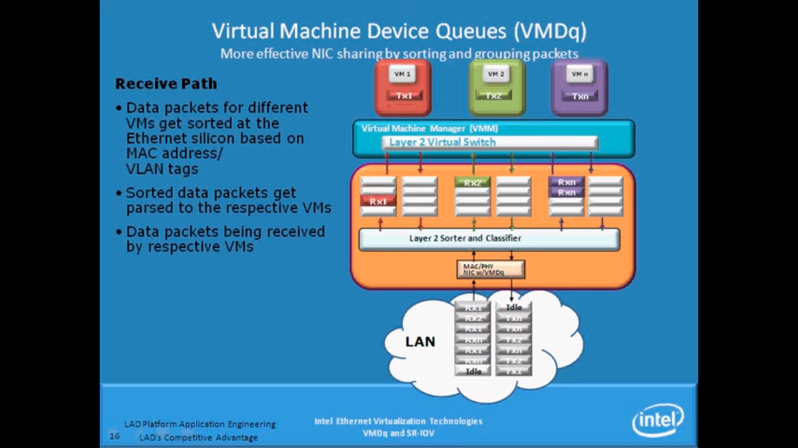
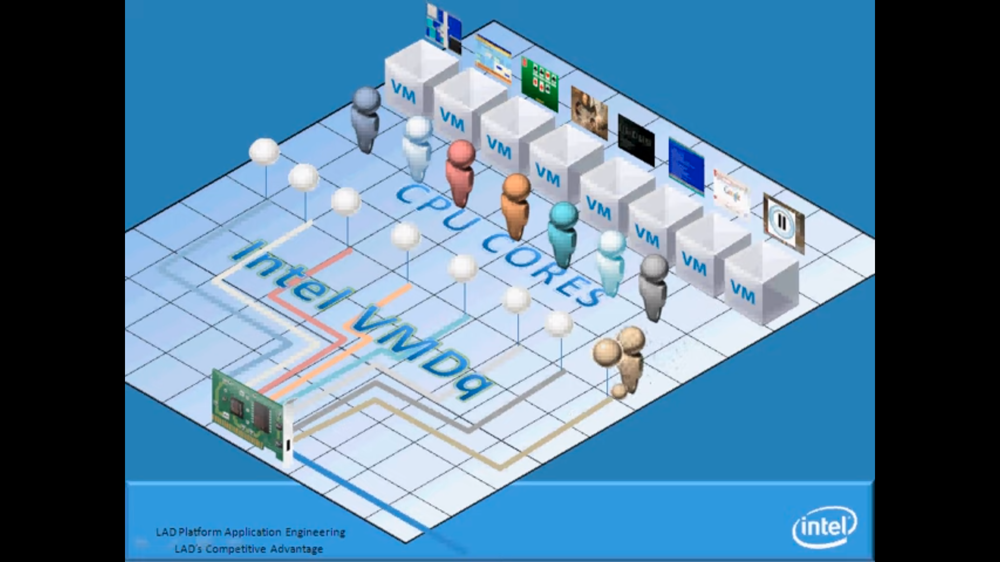


About SR-IOV(Single Root IO Virtualization): https://www.youtube.com/watch?v=hRHsk8Nycdg
=> DMA'd
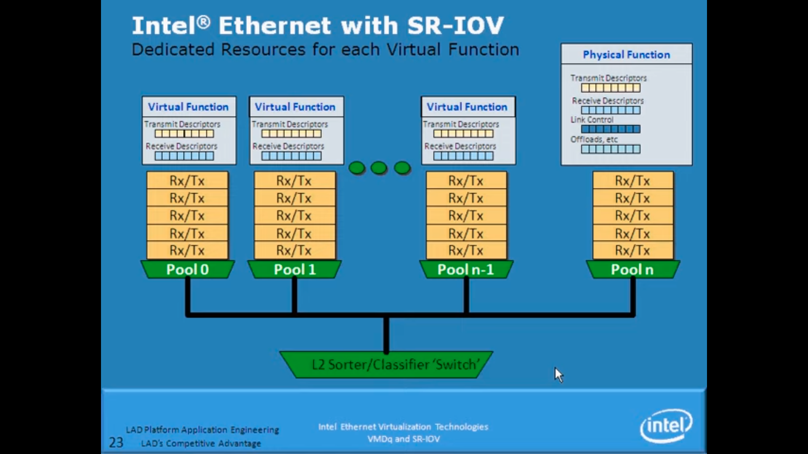
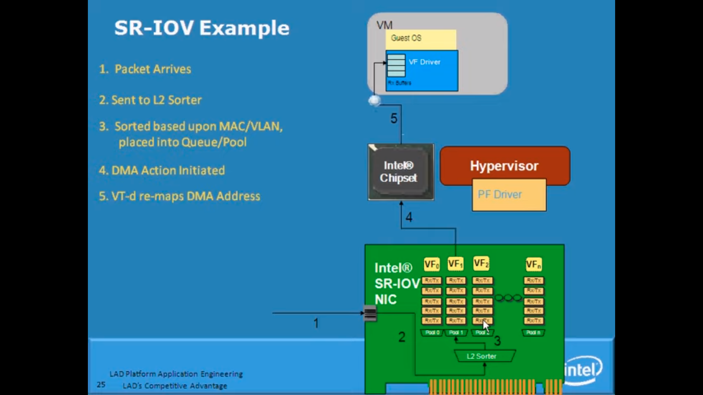
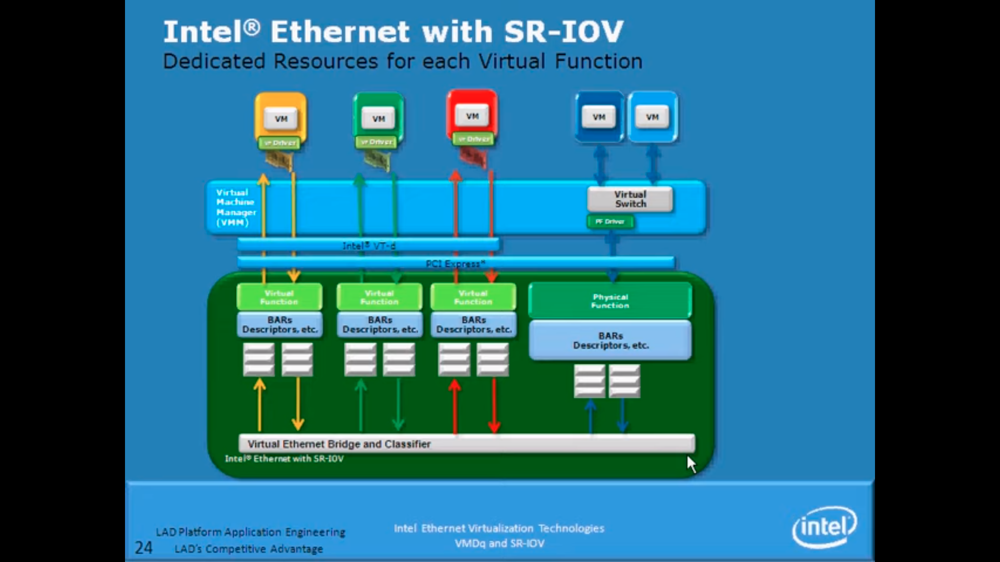
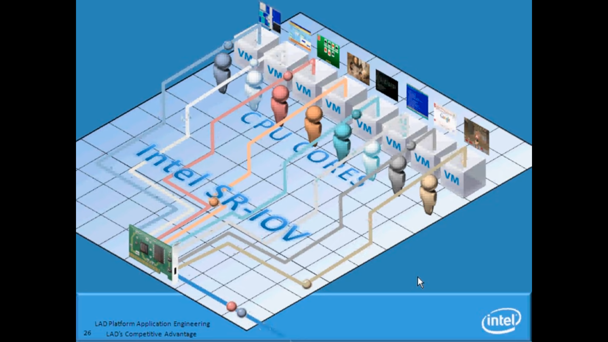


### 2020-10-28
Analysis of code flow: set sriov_numvf to be 2 ---(?)----> interface 1, 2 created

- main
ixgbe_main.c
```c
#ifdef HAVE_RHEL6_SRIOV_CONFIGURE
static struct pci_driver_rh ixgbe_driver_rh = {
	.sriov_configure = ixgbe_pci_sriov_configure,
};
#endif
```

- sriov main
ixgbe_sriov.c
```c
int ixgbe_pci_sriov_configure(struct pci_dev *dev, int num_vfs)
{
	if (num_vfs == 0)
		return ixgbe_pci_sriov_disable(dev);
	else
		return ixgbe_pci_sriov_enable(dev, num_vfs);
}
``` 

- if num_vfs != 0, enable
```c
static int ixgbe_pci_sriov_enable(struct pci_dev __maybe_unused *dev, int __maybe_unused num_vfs)
{
...
    // !set here
	err = __ixgbe_enable_sriov(adapter, num_vfs);
	if (err)
		goto err_out;

	for (i = 0; i < adapter->num_vfs; i++)
		ixgbe_vf_configuration(dev, (i | 0x10000000));

	/* reset before enabling SRIOV to avoid mailbox issues */
	ixgbe_sriov_reinit(adapter);

	err = pci_enable_sriov(dev, num_vfs);
	if (err) {
		e_dev_warn("Failed to enable PCI sriov: %d\n", err);
		goto err_out;
	}
	ixgbe_get_vfs(adapter);

out:
	return num_vfs;

err_out:
	return err;
...
}
```

1.  enable sriov
```c
static int __ixgbe_enable_sriov(struct ixgbe_adapter *adapter,
				unsigned int num_vfs)
```
=> flag setups : SRIOV, VMDQ

=> vfinfo setups

=> num_vfs

=> alloc_vf_macvlans *

=> ring feature

=> L2SWITCH, SRIOV REPLICATION flags


2.  ixgbe_vf_configuration
```c
#ifdef CONFIG_PCI_IOV
int ixgbe_vf_configuration(struct pci_dev *pdev, unsigned int event_mask)
{
	unsigned char vf_mac_addr[6];
	struct ixgbe_adapter *adapter = pci_get_drvdata(pdev);
	unsigned int vfn = (event_mask & 0x3f);
	bool enable = ((event_mask & 0x10000000U) != 0);

	if (enable) {
		memset(vf_mac_addr, 0, ETH_ALEN);
		memcpy(adapter->vfinfo[vfn].vf_mac_addresses, vf_mac_addr, 6);
	}

	return 0;
}
```
-> allocate mac address

struct ixgbe_hw
```c
struct ixgbe_hw *hw = &adapter->hw;
``` 

3. reinit
```c
ixgbe_sriov_reinit(adapter);
```

4. pci_enable_sriov
```c
err = pci_enable_sriov(dev, num_vfs);
```

5. ixgbe_get_vfs(adapter)
```c
ixgbe_get_vfs(adapter);
```

- others
@ ixgbe_type.h
```c
struct ixgbe_hw {
	u8 IOMEM *hw_addr;
	void *back;
	struct ixgbe_mac_info mac;
	struct ixgbe_addr_filter_info addr_ctrl;
	struct ixgbe_fc_info fc;
	struct ixgbe_phy_info phy;
	struct ixgbe_link_info link;
	struct ixgbe_eeprom_info eeprom;
	struct ixgbe_bus_info bus;
	struct ixgbe_mbx_info mbx;
	const u32 *mvals;
	u16 device_id;
	u16 vendor_id;
	u16 subsystem_device_id;
	u16 subsystem_vendor_id;
	u8 revision_id;
	bool adapter_stopped;
	int api_version;
	bool force_full_reset;
	bool allow_unsupported_sfp;
	bool wol_enabled;
	bool need_crosstalk_fix;
};
```

- struct ixgbe_adapter
@ixgbe.h
```c
/* board specific private data structure */
struct ixgbe_adapter {
...

	/* Some features need tri-state capability,
	 * thus the additional *_CAPABLE flags.
	 */
	u32 flags;
...

#define IXGBE_FLAG_VMDQ_ENABLED			(u32)(1 << 11)
...
#define IXGBE_FLAG_SRIOV_ENABLED		(u32)(1 << 20)
...
	int num_q_vectors;	/* current number of q_vectors for device */
	int max_q_vectors;	/* upper limit of q_vectors for device */
	struct ixgbe_ring_feature ring_feature[RING_F_ARRAY_SIZE];
	struct msix_entry *msix_entries;
...
};
```

struct ring_feature
@ixgbe.h
```c
struct ixgbe_ring_feature {
	u16 limit;	/* upper limit on feature indices */
	u16 indices;	/* current value of indices */
	u16 mask;	/* Mask used for feature to ring mapping */
	u16 offset;	/* offset to start of feature */
};
```

- allocate vf macvlan, set offset, enable L2 switch
```c
adapter->num_vfs = num_vfs;

ixgbe_alloc_vf_macvlans(adapter, num_vfs);

adapter->ring_feature[RING_F_VMDQ].offset = num_vfs;

/* enable L2 switch and replication */
adapter->flags |= IXGBE_FLAG_SRIOV_L2SWITCH_ENABLE |
			IXGBE_FLAG_SRIOV_REPLICATION_ENABLE;
```


### 2020-10-27
- successfully set 2 VMs with SR-IOV: https://software.intel.com/content/www/us/en/develop/articles/configure-sr-iov-network-virtual-functions-in-linux-kvm.html#vf-interface-name 

	todo:
	- check funciton ixgbe_pci_sriov_configure @ ixgbe_sriov.c
	- check function ixgbe_pci_sriov_enable @ixgbe_sriov.c
	- check function ixgbe_enable_sriov @ ixgbe_sriov.c
 

### 2020-10-26
- assigning static ip address by: https://www.cyberciti.biz/faq/linux-kvm-libvirt-dnsmasq-dhcp-static-ip-address-configuration-for-guest-os/

### 2020-09-22
- completed SR-IOV setup based on:
https://software.intel.com/content/www/us/en/develop/articles/configure-sr-iov-network-virtual-functions-in-linux-kvm.html

- setups
assigned 1 vm, with SR-IOV

- ping test

vm0 -> server0 -> NIC(1G)   ------------------------> NIC -> server1 (vm without SR-IOV)
```
PING 115.145.179.20 (115.145.179.20) 56(84) bytes of data.
64 bytes from 115.145.179.20: icmp_seq=7 ttl=64 time=0.473 ms
64 bytes from 115.145.179.20: icmp_seq=8 ttl=64 time=0.476 ms
64 bytes from 115.145.179.20: icmp_seq=9 ttl=64 time=0.439 ms
64 bytes from 115.145.179.20: icmp_seq=10 ttl=64 time=0.443 ms
64 bytes from 115.145.179.20: icmp_seq=11 ttl=64 time=0.379 ms
^C
--- 115.145.179.20 ping statistics ---
11 packets transmitted, 5 received, 54% packet loss, time 10232ms
rtt min/avg/max/mdev = 0.379/0.442/0.476/0.034 ms
```
	
vm0 -> server0 -> NIC(10G) ------------------------> NIC -> server1(vm with SR-IOV)
```
PING 10.0.0.4 (10.0.0.4) 56(84) bytes of data.
64 bytes from 10.0.0.4: icmp_seq=1 ttl=64 time=0.192 ms
64 bytes from 10.0.0.4: icmp_seq=2 ttl=64 time=0.119 ms
64 bytes from 10.0.0.4: icmp_seq=3 ttl=64 time=0.122 ms
64 bytes from 10.0.0.4: icmp_seq=4 ttl=64 time=0.119 ms
64 bytes from 10.0.0.4: icmp_seq=5 ttl=64 time=0.116 ms
^C
--- 10.0.0.4 ping statistics ---
5 packets transmitted, 5 received, 0% packet loss, time 4085ms
rtt min/avg/max/mdev = 0.116/0.133/0.192/0.031 ms

```

server0 -> NIC(1G) ------------------------> NIC -> server1 ( no vm setup )
```
PING 115.145.179.20 (115.145.179.20) from 115.145.179.15 enp0s25: 56(84) bytes of data.
64 bytes from 115.145.179.20: icmp_seq=1 ttl=64 time=0.130 ms
64 bytes from 115.145.179.20: icmp_seq=2 ttl=64 time=0.163 ms
64 bytes from 115.145.179.20: icmp_seq=3 ttl=64 time=0.166 ms
64 bytes from 115.145.179.20: icmp_seq=4 ttl=64 time=0.162 ms
64 bytes from 115.145.179.20: icmp_seq=5 ttl=64 time=0.164 ms
^C
--- 115.145.179.20 ping statistics ---
5 packets transmitted, 5 received, 0% packet loss, time 4086ms
rtt min/avg/max/mdev = 0.130/0.157/0.166/0.013 ms
```

### 2020-09-17
- overview of packet reception: https://access.redhat.com/documentation/en-us/red_hat_enterprise_linux/6/html/performance_tuning_guide/s-network-packet-reception

- commands
	- image creation
```
qemu-img create -f qcow2 ~/QEMU/img.qcow2 10G
```
	- 
```
sudo qemu-system-x86_64   -m 2048   -vga virtio   -show-cursor   -usb        -device usb-tablet    -enable-kvm   -cdrom ~/QEMU/ubuntu-18.04.5-live-server-amd64.iso   -drive file=~/QEMU/img.qcow2,if=virtio   -cpu host 

sudo qemu-system-x86_64   -m 2048   -vga virtio   -show-cursor   -usb        -device usb-tablet -serial null -nographic   -enable-kvm   -cdrom ~/QEMU/ubuntu-18.04.5-live-server-amd64.iso   -drive file=~/QEMU/img.qcow2,if=virtio   -cpu host 

sudo qemu-system-x86_64 -m 2048 -vga virtio -show-cursor -usb -device usb-tablet -serial mon:stdio -kernel -append '/dev/ttyS0' -nographic -enable-kvm -cdrom ~/QEMU/ubuntu-18.04.5-live-server-amd64.iso -drive file=~/QEMU/img.qcow2,if=virtio -cpu host

sudo qemu-system-x86_64 -m 2048 -vga virtio -show-cursor -usb -device usb-tablet -serial pty -nographic -enable-kvm -cdrom ~/QEMU/ubuntu-18.04.5-live-server-amd64.iso -drive file=~/QEMU/img.qcow2,if=virtio -cpu host
```

- setting ethernet on vm : not yet

### 2020-09-16
- Setting virtual machine: ssh -X was **successful**
- used virt-manager
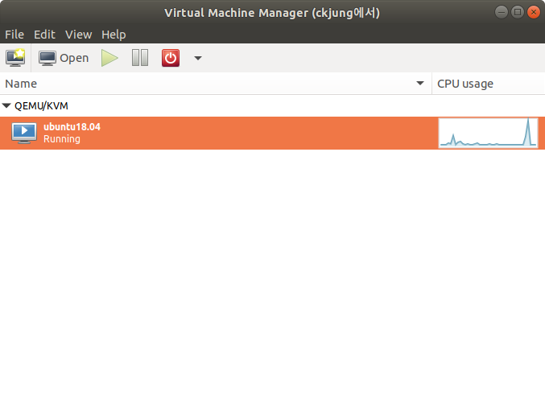
- host machine: server
- virtual machine
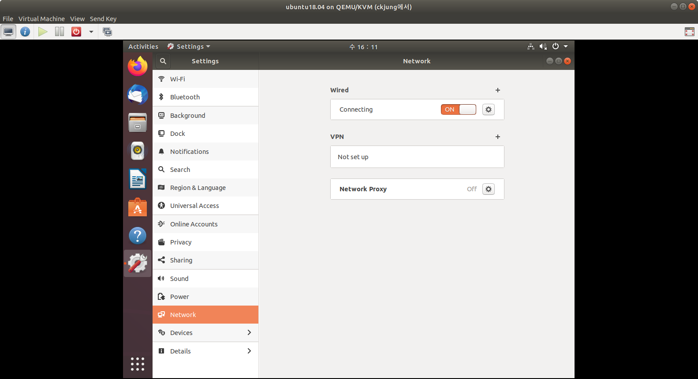
	- virtual machine setup
		- machine name: guest0
		- user name: vm0
		- pw ****
		- host device network: enpos25: mactap

### 2020-09-14
- Try setting up venv on server, failed
	- https://smdaudhilbe.wordpress.com/2013/04/11/how-to-install-ubuntu-inside-qemu-emulator-and-make-a-virtual-machine/

### 2020-09-10
- Concepts study: Virtualized Networking
	- SR-IOV
		- Separable : https://docs.microsoft.com/ko-kr/windows-hardware/drivers/network/overview-of-single-root-i-o-virtualization--sr-iov-
			- "Each PF and VF is assigned a unique PCI Express Requester ID (RID) that allows an I/O memory management unit (IOMMU) to differentiate between different traffic streams and apply memory and interrupt translations between the PF and VFs. This allows traffic streams to be delivered directly to the appropriate Hyper-V parent or child partition. As a result, nonprivileged data traffic flows from the PF to VF without affecting other VFs."
		- Architecture
						
		- PF
			- Enable Virtualization
			- exposing VFs
		- NIC Switch
			-  Setup : [OID_NIC_SWITCH_CREATE_SWITCH](https://docs.microsoft.com/ko-kr/windows-hardware/drivers/network/oid-nic-switch-create-switch)
			- VPORT: [OID_NIC_CREATE_VPORT](https://docs.microsoft.com/ko-kr/windows-hardware/drivers/network/oid-nic-switch-create-vport)
		- [Interface](https://docs.microsoft.com/ko-kr/windows-hardware/drivers/network/single-root-i-o-virtualization--sr-iov--interface)
			- PCIe VF is assigned a unique Requester ID.
			- IOMMU do:
				Distinguish/ isolation of traffic
			
	- VMQ
		- CPU Intervention needed	

### 2020-09-09
- Concept study: SR-IOV
	- History
		- NDIS 6.20: introduces the virtual machine queue (VMQ) interface to support Microsoft Hyper-V network performance improvements.
		- NDIS 6.30: https://docs.microsoft.com/ko-kr/windows-hardware/drivers/network/virtualized-networking-enhancements-in-ndis-6-30
		
			- SR-IOV: partitioning of the hardware resources on a PCI Express (PCIe) NW adapter -> virtual interfaces(VFs). 
			bypass the virtual software switch layer by assigning a VF to the Hyper-V child partition directly. 
			- Hyper-V Extensible Switch: virtualized ethernet switch, runs in the management operating system of the Hyper-V parent partition.
			
	- SR-IOV
		
		 
		- PF: parent
		- VF: child
		- idea: PF for CPU, VF for GPU (by on/off?)
		
- tomorrow
	- Detailed study on SR-IOV
	- Details on RSS and others (https://www.kernel.org/doc/Documentation/networking/scaling.txt)
	- Search for keyword VMQ (https://www.intel.co.kr/content/www/kr/ko/support/articles/000006703/network-and-i-o/ethernet-products.html)
	
### 2020-09-08

- Concept study: RSS(Receive Side Scaling)
	- Introduction to RSS: 
	https://docs.microsoft.com/en-us/windows-hardware/drivers/network/introduction-to-receive-side-scaling
- Searching for sNIC / programmable NIC to modify RSS part
	- SmartNIC
		- [ConnectX-6 Lx Dual 25GbE / Single 50GbE SmartNIC](https://www.mellanox.com/files/doc-2020/pb-connectx-6-lx-en-card.pdf) : Stateless Offloads – Received Side Scaling (RSS) also on encapsulated packet
		- [ConnectX-6 Dx Dual 100GbE / Single 200GbE SmartNIC](https://www.mellanox.com/files/doc-2020/pb-connectx-6-dx-en-card.pdf)
		- [ConnectX®-6 200GbE Single/Dual-Port Adapters](https://www.mellanox.com/files/doc-2020/pb-connectx-6-en-card.pdf)
		- [ConnectX®-5 100GbE Single/Dual-Port Adapters](https://www.mellanox.com/files/doc-2020/pb-connectx-5-en-card.pdf)
		- [ConnectX®-4 Lx EN 10/25/40/50GbE Ethernet Adapter Cards](https://www.mellanox.com/files/doc-2020/pb-connectx-4-lx-en-card.pdf)
	- Programmable SNIC
		- [bluefield-2-smart-nic](https://www.mellanox.com/files/doc-2020/pb-bluefield-2-smart-nic-eth.pdf) – RSS (also on encapsulated packets), TSS, HDS, VLAN insertion/stripping, Receive Flow Steering
		- [bluefield-smart-nic](https://www.mellanox.com/files/doc-2020/pb-bluefield-smart-nic.pdf) – RSS (also on encapsulated packets), TSS, HDS, VLAN insertion/stripping, Receive Flow Steering 
		- [innova-2-flex](https://www.mellanox.com/files/doc-2020/pb-innova-2-flex.pdf) – RSS VLAN and MPLS tag insertion/stripping,
Receive flow steering
- Tomorrow
	- Details on RSS and others (https://www.kernel.org/doc/Documentation/networking/scaling.txt)
	- Search for keyword VMQ (https://www.intel.co.kr/content/www/kr/ko/support/articles/000006703/network-and-i-o/ethernet-products.html)
	
### 2020-09-07

- Concept study: RSS(Receive Side Scaling)
	- Introduction to RSS: 
	https://docs.microsoft.com/en-us/windows-hardware/drivers/network/introduction-to-receive-side-scaling
- Searching for sNIC / programmable NIC to modify RSS part
	- Hard to find
	- Community guide
